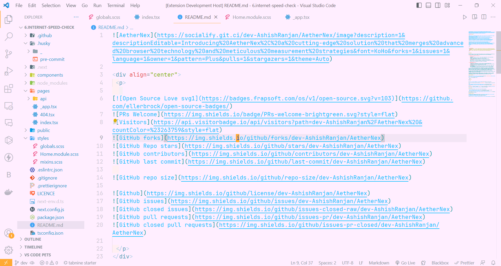
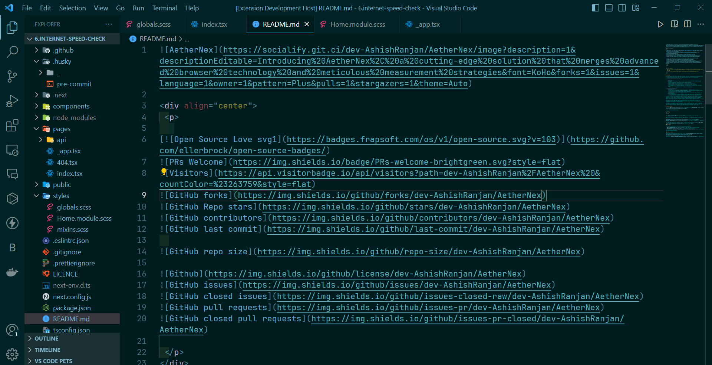
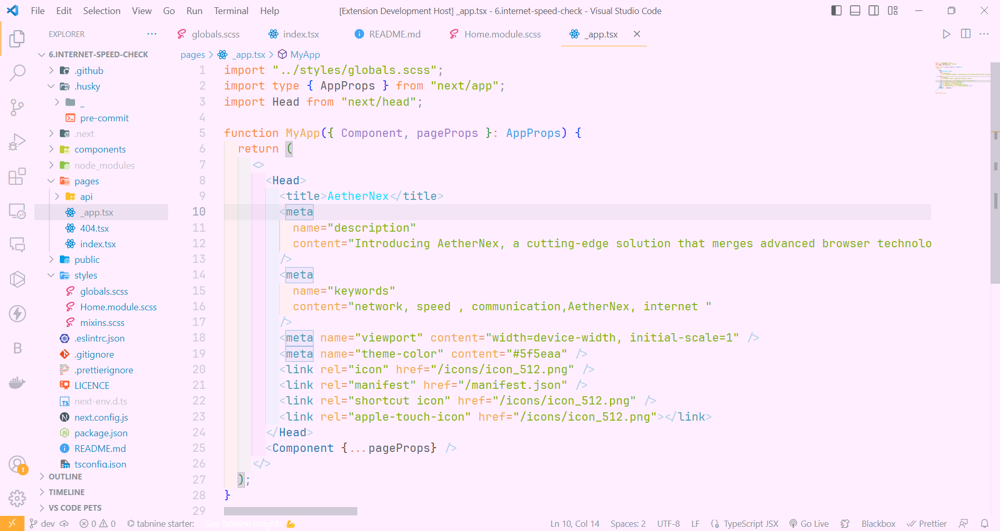
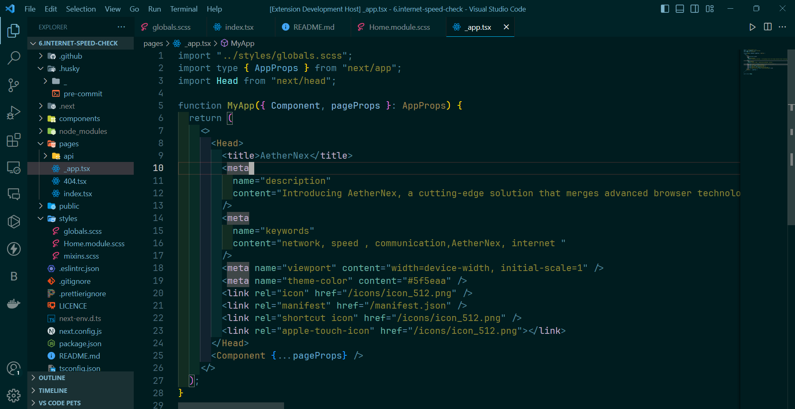
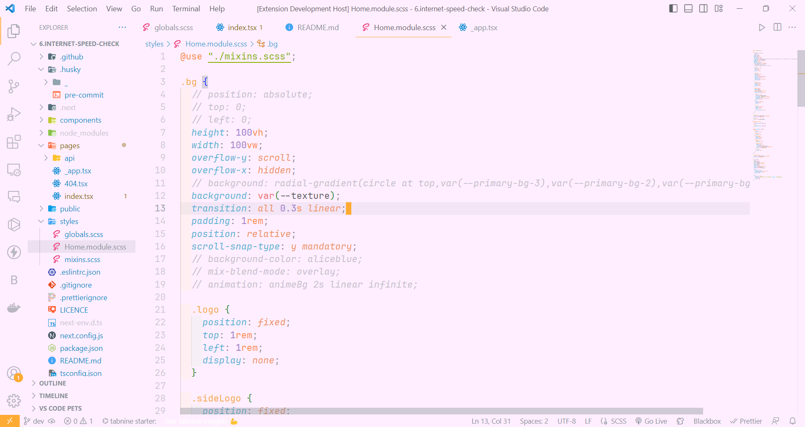
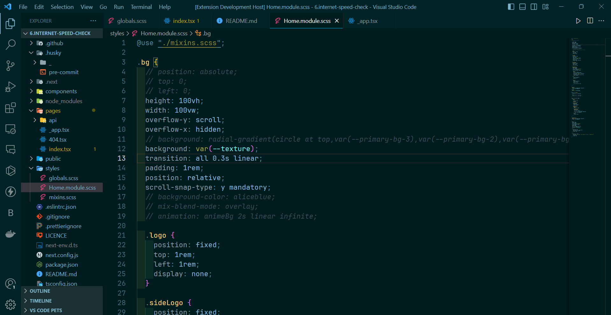

<div align="center">
 <p>
   
[](https://github.com/ellerbrock/open-source-badges/)


  


 </p>
</div>

---

# Installation via VS Code

1. Open **Extensions** sidebar panel in VS Code. `View → Extensions`
2. Search for `Ash Theme`
3. Click on **Ash Theme** 
4. Click **Install** to install it
5. Click **Reload** to reload the editor
6. Code > Preferences > Color Theme > **Ash Theme**
select dark or light theme, as per your preferences

---

# Development
Steps to create a new theme in VS Code

1. install yo
  ```
  npm install -g yo
  ```
2. Install generator (we are using code)
  ```
  npm install generator-code -g
  ```

3. Initilize a code using yo
  ```
  npx yo code
  ```
  This command will guide you through setting up your extension, including selecting the theme type.

4. Develop Your Theme

  Open the project folder in your preferred code editor.
  Navigate to the `themes` folder in your project directory. This is where you'll define your theme's color scheme and styling.
  Edit the `.json` file in the `themes` folder to define the color scheme and other theme-related settings. You can also use a tool like "Theme Color Picker" in VS Code to help you design the color palette.

5. Test your Theme

  use `F5` to start a dev vscode.
  There Select your theme.
  To change your theme in the new vscode window use `CTRL + K` + `CTRL + T`. Now a list of themes appear, select your development theme, it's shown there.

6. Publish
  ```
  vsce login <publisher_id>
  ```

  ```
  vsce publish
  ```
  All code in CLI or Terminal

---

# Theme Preview
Here are some pics showcasing the Light and Dark Mode side-by-side, ***Ash Light Theme*** and ***Ash Dark Theme*** Respectively

|LIGHT |DARK |
|---|---|
|||
|||
|||


## For more information

* [Visual Studio Code's Markdown Support](http://code.visualstudio.com/docs/languages/markdown)
* [Markdown Syntax Reference](https://help.github.com/articles/markdown-basics/)

**Enjoy!**
